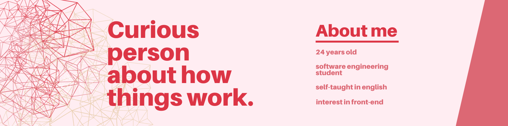

<h2  align="center"> Welcome     Bem-vindo(a)  </h2>

<h3 align="center">Fico muito feliz que você tenha chegado até aqui,  então deixe-me apresentar neste breve resumo á você:</h3>
<h4><strong> 🙋🏻 Quem é a Ester quanto pessoa?</strong></h4>

Sou uma pessoa muito dedicada no que se propõe a fazer e não desistindo no primeiro desafio. Sou uma pessoa adaptativa aos diversos ambientes, acredito que por conta disso sou de fácil relacionamento e comunicativa com todos ao meu redor.

<h4><strong>👓 Quem é a Ester quanto a tecnologia?</strong></h4>

A curiosidade e a vontade de aprender sempre foram uns dos meus pontos fortes, sempre procurando me aprimorar e me desenvolver mais. Atualmente no 3° semestre de Engenharia de Software estudo Análise orientada a objetos, como também Redes e sistemas distribuídos. Como também conclui cursos na parte de front-end, sendo Web Designer em 2015. Porém venho reforçando os mesmos conhecimentos atualmente por meio de cursos na Udemy Finalizando um dos cursos longos, onde iniciei no começo de 2022 um curso sobre Desenvolvimento Web que aborda desde Bootstrap, Scss ao PHP e SQL.

 

[comment]: 
  

<h3>Where to find me   Onde me encontrar</h3>

 

&nbsp;&nbsp;
